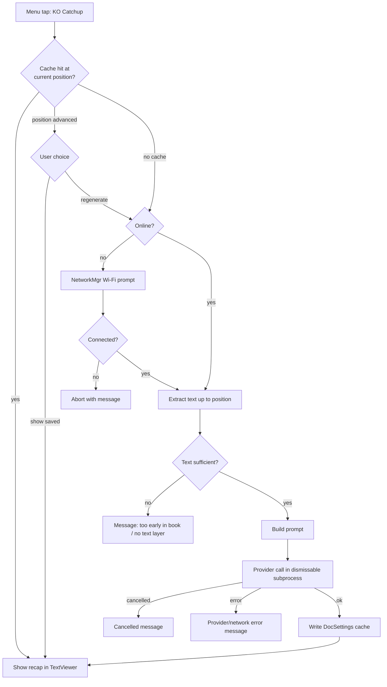
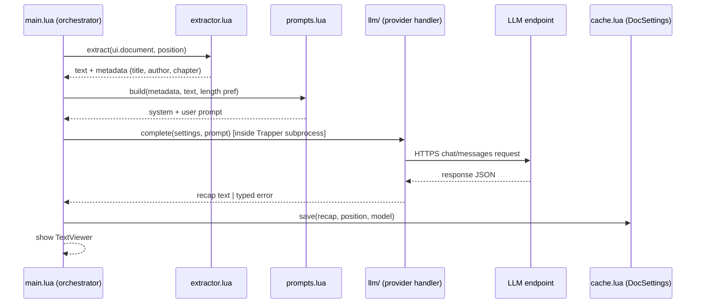

# KO Catchup KOReader Plugin - Plan

## Goal Capsule

- **Objective:** Build `kocatchup.koplugin`, a user-installable KOReader plugin that generates a spoiler-safe AI recap of the current book up to the reader's current position — the KOReader equivalent of Kindle's "Story So Far" feature.
- **Authority:** This plan governs scope and decisions; KOReader upstream conventions (Lua style, widget usage) govern code idiom where the plan is silent.
- **Execution profile:** Greenfield repo (this directory). Lua (LuaJIT / Lua 5.1 semantics). No CI yet; verification is busted unit tests plus KOReader desktop-emulator smoke runs.
- **Stop conditions:** Stop and surface if (a) the KOReader APIs named in the Planning Contract don't exist or behave differently in the current KOReader release, (b) text extraction proves unusably slow on target hardware and the fallback in KTD1 also fails, or (c) any change would require modifying KOReader core rather than staying plugin-local.
- **Tail ownership:** The implementer owns packaging the release zip and updating the README; distribution beyond the repo (contrib/appstore listing) is deferred follow-up work.

---

## Product Contract

### Summary

A KOReader plugin that, from the reader menu of an open book, extracts the book text from the start up to the current reading position, sends it to a user-configured LLM (OpenAI-compatible endpoint or Anthropic; covers local Ollama), and shows a recap of the story so far in a scrollable viewer. Recaps are cached per book so re-opening one costs nothing and works offline.

### Problem Frame

Kindle's "Story So Far" gives readers a spoiler-free refresher when returning to a book after a break — a "previously on..." for books. KOReader (the open-source reader for Kobo/Kindle/PocketBook/Android/desktop) has no built-in equivalent. The community Assistant plugin proves the underlying mechanics (position-aware text extraction, LLM calls from e-ink devices) but bundles them inside a large general-purpose AI assistant. This plugin delivers the single focused feature: one menu tap, one recap, spoiler-safe by construction.

### Requirements

**Recap generation**

- R1. While a book is open, the user can trigger "KO Catchup" from the reader's main menu (and via a dispatcher action assignable to gestures); the plugin generates a recap covering only the story up to the current reading position.
- R2. Spoiler safety is structural: only text located before the current position is ever sent to the model. The prompt additionally instructs the model not to speculate about what happens next.
- R3. Extraction works for crengine formats (EPUB, FB2, HTML, MOBI) via xpointer-range text; page-based formats (PDF, DjVu) are best-effort via page-text with a bounded lookback window. Image-only PDFs fail with a clear message.

**Providers and configuration**

- R4. The user configures a provider (OpenAI-compatible chat-completions endpoint or Anthropic messages API), base URL, model, and API key. An OpenAI-compatible endpoint covers OpenAI, OpenRouter, Groq, and self-hosted Ollama.
- R5. Configuration persists in a settings file under KOReader's settings directory so it survives plugin reinstalls/updates.

**Experience**

- R6. Generation never blocks the UI: it runs as a cancellable subprocess with a progress message, and is gated on network availability with KOReader's standard "turn on Wi-Fi" prompt.
- R7. The recap displays in a scrollable text viewer with the book title in the viewer title.
- R8. The most recent recap is cached per book with the position it covered. Re-triggering at the same position shows the cache instantly (works offline); if the position has advanced, the user is offered the cached recap or a fresh one.

**Errors**

- R9. Missing API key, network failure, provider errors, and insufficient text (e.g., position at 0%) each produce a specific, actionable message — never a silent failure or a raw Lua error.

**Packaging**

- R10. The plugin ships as a `kocatchup.koplugin` directory installable by copying into KOReader's `plugins` folder, licensed GPL-3.0, with a README covering installation and provider setup (including Ollama).

### Key Flows

- F1. Fresh recap
  - **Trigger:** User taps "KO Catchup" in the reader menu with a book open.
  - **Steps:** Cache miss → network gate (Wi-Fi prompt if offline) → progress message → extract text up to position → build prompt → provider call in cancellable subprocess → show recap in viewer → write cache.
  - **Outcome:** Recap on screen; cached for next time. Covered by R1, R2, R6, R7, R8.
- F2. Cached recap
  - **Trigger:** User re-triggers at the same position, or offline.
  - **Steps:** Cache hit at current position → show immediately, no network. If position advanced: offer "show saved recap" vs "generate updated recap".
  - **Outcome:** Instant offline recap or explicit regeneration. Covered by R8.
- F3. Failure paths
  - **Trigger:** No API key, no network and user declines Wi-Fi, provider 4xx/5xx, user cancels, or no extractable text.
  - **Outcome:** Specific message per case; reader state untouched. Covered by R6, R9.

### Scope Boundaries

- Single-book recaps only; recap language is the book's language as the model infers it (no translation feature).
- No text is ever sent anywhere without an explicit user trigger.

**Deferred to Follow-Up Work**

- Series-level recaps (Kindle "Recaps" equivalent across earlier books in a series).
- Auto-offered recap when opening a book after a long break (Assistant does this via a fragile core monkey-patch; revisit with a proper `onReaderReady` event handler).
- Streaming token-by-token display; markdown-rendered viewer.
- Listing in koreader/contrib or the community appstore.koplugin.

**Outside this product's identity**

- General chat-with-book, X-Ray, translation, or highlight-based Q&A — the Assistant plugin already covers these.

---

## Planning Contract

### Key Technical Decisions

- KTD1. **Text extraction reuses the field-proven Assistant pattern.** For crengine documents: capture current xpointer, jump to document start to get the start xpointer, restore position, then `getTextFromXPointers(start, current)`; truncate to the tail ~100k characters and repair UTF-8 boundaries. For page-based documents: concatenate `getPageText` over a bounded lookback (~250 pages) ending at the current page. Rationale: proven on real devices by the Assistant plugin's X-Ray feature; parsing the EPUB file externally and mapping crengine positions to it is fragile. Fallback if whole-range extraction is too slow on large books: extract per-chapter via TOC xpointers.
- KTD2. **Two provider handlers behind one interface: OpenAI-compatible and Anthropic.** A provider module takes (settings, prompt) and returns (text | error). The OpenAI-compatible handler covers OpenAI, OpenRouter, Groq, and Ollama via configurable base URL, so cloud-vs-local is a configuration choice, not an architecture fork. No per-vendor handler sprawl in v1.
- KTD3. **All network work runs through `Trapper:wrap` + `Trapper:dismissableRunInSubprocess`.** KOReader's UI loop is single-threaded; blocking HTTPS calls (luasocket/luasec, bundled) freeze the device. The subprocess pattern gives cancel-on-tap for free. Wi-Fi gating via `NetworkMgr:runWhenOnline`.
- KTD4. **Settings live in a LuaSettings file under KOReader's settings directory** (`DataStorage:getSettingsDir()`), not a `configuration.lua` inside the plugin folder. Rationale: the plugin folder is replaced wholesale on update; the settings dir survives. (Both precedent AI plugins use the in-folder file and lose config on reinstall.)
- KTD5. **Recap cache lives in the book's DocSettings sidecar** under a plugin-namespaced key storing recap text, covered position (xpointer or page), model, and timestamp. Rationale: the sidecar already travels with per-book state, is loaded when the book opens, and avoids maintaining a parallel file-path-keyed store.
- KTD6. **Manual trigger only in v1** — a main-menu item plus a registered dispatcher action (gesture-assignable). No monkey-patching of `ReaderUI` for auto-popups; that is the fragile part of the Assistant design and is deferred.
- KTD7. **License GPL-3.0.** The extraction approach derives from the GPL-3.0 Assistant plugin, and KOReader itself is AGPL; GPL-3.0 is the compatible, conventional choice. The unlicensed `Koreader-Book-Recap` repo is ideas-only — no code reuse.
- KTD8. **Testing splits into busted unit tests for pure logic and emulator smoke for UI.** KOReader modules are stubbed via `package.preload` mocks so extractor/prompt/provider/cache logic tests run on plain LuaJIT without a device; UI wiring is verified in the KOReader desktop emulator.

### High-Level Technical Design

Recap generation flow (branch gates):



Component interaction for the provider call:



Prose stays authoritative where the diagrams and text disagree.

### Deferred to implementation

- Exact truncation size and PDF lookback depth (start from Assistant's 100k chars / 250 pages; tune on hardware).
- Recap prompt wording and length presets (short/standard/detailed) — tune against real books during implementation.
- Whether extraction needs the per-chapter TOC fallback (only if whole-range extraction is measurably slow).

---

## Output Structure

```text
kocatchup.koplugin/
  _meta.lua            -- fullname + description for the plugin manager
  main.lua             -- WidgetContainer plugin: menu, dispatcher, orchestration
  extractor.lua        -- text-up-to-position extraction (crengine + page-based)
  prompts.lua          -- prompt templates and builder
  cache.lua            -- DocSettings-sidecar recap cache
  settings.lua         -- settings persistence + settings submenu dialogs
  llm/
    init.lua           -- provider dispatch + shared HTTP/JSON plumbing
    openai.lua         -- OpenAI-compatible chat-completions handler
    anthropic.lua      -- Anthropic messages handler
spec/
  helper.lua           -- package.preload mocks for KOReader modules
  extractor_spec.lua
  prompts_spec.lua
  llm_spec.lua
  cache_spec.lua
README.md
LICENSE                -- GPL-3.0
```

---

## Implementation Units

### U1. Plugin skeleton and menu registration

- **Goal:** A loadable `kocatchup.koplugin` that appears in the reader's Tools menu and fires a placeholder action.
- **Requirements:** R1 (trigger surface), R10 (installable shape).
- **Dependencies:** none.
- **Files:** `kocatchup.koplugin/main.lua`, `kocatchup.koplugin/_meta.lua`, `spec/helper.lua`.
- **Approach:** `WidgetContainer:extend` with `name = "kocatchup"`, `is_doc_only = true`; register a dispatcher action (`reader = true`) and a main-menu item with `sorting_hint = "more_tools"`; placeholder callback shows an InfoMessage. `spec/helper.lua` establishes the mock loader pattern the later units' tests build on.
- **Execution note:** Smoke-first — prove the plugin loads in the KOReader desktop emulator before adding logic; unit coverage here is limited to "module loads under mocks."
- **Test scenarios:**
  - `main.lua` loads under `spec/helper.lua` mocks without error and exposes `name = "kocatchup"`.
  - Emulator smoke: plugin listed in plugin manager; menu item present with a book open; absent in the file manager (doc-only).
- **Verification:** Menu item visible and tappable in the emulator with an EPUB open.

### U2. Text extraction up to position

- **Goal:** Given the open document, return the book text from the start to the current position, plus metadata (title, author, current chapter), safely truncated.
- **Requirements:** R2, R3.
- **Dependencies:** U1.
- **Files:** `kocatchup.koplugin/extractor.lua`, `spec/extractor_spec.lua`.
- **Approach:** Per KTD1. Branch on `document.info.has_pages`. crengine path: xpointer round-trip then `getTextFromXPointers`; page path: `getPageText` loop handling both string and word-span-table returns. Tail-truncate, fix UTF-8 boundary, and collect metadata from doc props and `ui.toc:getTocTitleByPage`. Return a typed result (`text`, `metadata`) or a typed failure (`no_text`, `too_short`).
- **Patterns to follow:** Assistant plugin's `extractBookTextForAnalysis` (structure, not copied code beyond what GPL-3.0 licensing permits — see KTD7).
- **Test scenarios:**
  - Covers F1. Mock crengine document: extraction returns exactly the text between start and current xpointers; position restored after the round-trip.
  - Mock page-based document at page 300 with lookback 250: pages 50-300 concatenated; word-span-table pages joined with spaces.
  - Text longer than the truncation cap: result keeps the tail (most recent text), starts on a valid UTF-8 boundary.
  - Position at document start: returns `too_short` failure, not an empty-string success.
  - Page-based document returning no text (image-only PDF): returns `no_text` failure.
- **Verification:** All extractor specs pass under busted; emulator check that extraction on a real EPUB returns plausible text ending at the reading position.

### U3. Provider layer and settings persistence

- **Goal:** A provider-agnostic `complete(settings, prompt) → recap | typed error` covering OpenAI-compatible and Anthropic APIs, plus persistent settings.
- **Requirements:** R4, R5, R9 (error typing).
- **Dependencies:** U1.
- **Files:** `kocatchup.koplugin/llm/init.lua`, `kocatchup.koplugin/llm/openai.lua`, `kocatchup.koplugin/llm/anthropic.lua`, `kocatchup.koplugin/settings.lua` (persistence half), `spec/llm_spec.lua`.
- **Approach:** Handlers build request tables (URL, headers, JSON body) and parse responses; a shared HTTP function does the blocking luasocket/luasec call with ltn12 and size-dependent timeouts (the subprocess wrapping happens in U4, so handlers stay synchronous and testable). Errors map to types: `no_api_key`, `http_error(code)`, `bad_response`, `timeout`. Settings via LuaSettings at `DataStorage:getSettingsDir()/kocatchup.lua` per KTD4 with schema: provider, base_url, model, api_key, recap_length.
- **Patterns to follow:** Assistant's `api_handlers/base.lua` request shape; wallabag plugin for settings-dialog conventions (referenced in U5).
- **Test scenarios:**
  - OpenAI handler: request body has model + messages; recap extracted from `choices[1].message.content`; Authorization header carries the key.
  - Anthropic handler: `x-api-key` + `anthropic-version` headers; recap extracted from `content[1].text`.
  - Missing API key returns `no_api_key` without attempting a request (Ollama exception: empty key allowed when base_url is set and provider is openai-compatible).
  - HTTP 401/429/500 map to `http_error` with the code; malformed JSON maps to `bad_response`.
  - Settings round-trip: save then reload returns identical values; missing file yields defaults.
- **Verification:** llm specs pass under busted with a stubbed HTTP function; one manual request against a real endpoint (Ollama or a cloud key) returns a completion.

### U4. Recap orchestration, prompt, and viewer

- **Goal:** The end-to-end fresh-recap flow: network gate → extract → prompt → provider call in a cancellable subprocess → TextViewer.
- **Requirements:** R1, R2 (prompt half), R6, R7, R9.
- **Dependencies:** U2, U3.
- **Files:** `kocatchup.koplugin/main.lua`, `kocatchup.koplugin/prompts.lua`, `spec/prompts_spec.lua`.
- **Approach:** Menu callback wraps the flow in `NetworkMgr:runWhenOnline` + `Trapper:wrap`; progress via `Trapper:info`; provider call inside `Trapper:dismissableRunInSubprocess`. Prompt: system message frames "you are producing a spoiler-free 'story so far' recap; summarize only the provided text; do not predict or reveal anything beyond it," user message carries title/author/chapter and the extracted text. Each typed failure from U2/U3 maps to a distinct InfoMessage.
- **Test scenarios:**
  - Covers F1. Prompt builder: output contains book title and extracted text; system prompt contains the no-forward-content instruction; respects the recap_length setting.
  - Prompt builder with metadata missing (no TOC/chapter): degrades without nil errors.
  - Error mapping table: each typed error (`no_api_key`, `http_error`, `no_text`, `too_short`, `timeout`) produces a distinct user-facing string (unit-testable as a pure mapping).
  - Emulator integration: full flow against a local Ollama or stub server shows a recap in TextViewer; tapping during generation cancels cleanly (Covers F3 cancel path).
- **Verification:** prompts specs pass; emulator run produces a recap end-to-end and cancel/no-network/no-key paths each show their specific message.

### U5. Recap cache and settings menu

- **Goal:** Cached recaps per book with position-aware reuse, and a settings submenu for provider configuration.
- **Requirements:** R5 (UI half), R8.
- **Dependencies:** U4.
- **Files:** `kocatchup.koplugin/cache.lua`, `kocatchup.koplugin/settings.lua` (dialog half), `kocatchup.koplugin/main.lua`, `spec/cache_spec.lua`.
- **Approach:** Per KTD5, store `{recap, position, percent, model, timestamp}` under a `kocatchup` key in the book's DocSettings sidecar. On trigger: same-position hit shows immediately; advanced position raises a ConfirmBox (saved vs regenerate); regenerating overwrites. Settings submenu under the main menu item: provider picker, base URL / model / API key input dialogs (MultiInputDialog), recap length picker.
- **Patterns to follow:** wallabag/bundled plugins for settings submenu and input-dialog conventions.
- **Test scenarios:**
  - Covers F2. Cache write then read at same position returns the recap without any provider call (assert via stubbed provider spy).
  - Position advanced: cache reports `stale` with the saved recap available; regeneration overwrites the entry.
  - Corrupt/missing cache entry degrades to a cache miss, not an error.
  - Settings dialogs: entered values persist through the U3 settings layer (emulator check).
- **Verification:** cache specs pass; emulator: second trigger at same position is instant and works with Wi-Fi off; settings survive a KOReader restart.

### U6. Packaging, README, and license

- **Goal:** The repo is installable and explains itself: README (install per platform dir, provider setup incl. Ollama, privacy note that book text is sent to the configured endpoint), GPL-3.0 LICENSE, release zip layout.
- **Requirements:** R10.
- **Dependencies:** U1-U5.
- **Files:** `README.md`, `LICENSE`, `kocatchup.koplugin/_meta.lua` (final description).
- **Approach:** README documents the tested KOReader version (no stable plugin API upstream — pin what was tested), install-by-copy paths for Kobo/Kindle/PocketBook/desktop, and configuration walkthrough.
- **Test expectation:** none — packaging/docs; verified by a fresh-install smoke: copy the folder into a clean KOReader emulator profile and generate a recap following only the README.
- **Verification:** Fresh-install smoke succeeds following README instructions alone.

---

## Verification Contract

| Gate | Command / procedure | Applies to |
|---|---|---|
| Unit tests | `busted spec` (LuaJIT + busted via luarocks; mocks in `spec/helper.lua`) | U1-U5 |
| Emulator smoke | Run KOReader desktop with the plugin copied into its `plugins/` dir; open an EPUB ~mid-book; generate, cancel, cached, offline, and no-key flows | U1, U4, U5 |
| Provider check | One real completion via Ollama (local) and one via a cloud OpenAI-compatible or Anthropic endpoint | U3, U4 |
| Fresh-install smoke | Clean emulator profile + README-only install and setup | U6 |

Behavioral quality bar: the recap for a familiar book at ~50% must describe only events before the position — spot-check against a book the tester knows.

## Definition of Done

- All units U1-U6 complete; `busted spec` green.
- Emulator smoke passes for: fresh recap, cancel mid-generation, cached re-open (offline), position-advanced choice, no-API-key message, no-network message, image-only-PDF message.
- At least one recap generated against a real cloud endpoint and one against Ollama.
- README enables a cold install without reading source; LICENSE present; `_meta.lua` description final.
- No dead code from abandoned approaches; no secrets (API keys) committed.

---

## Risks & Dependencies

- **KOReader has no stable plugin API** — third-party plugins routinely break across releases. Mitigation: depend only on widely-used surfaces (WidgetContainer, Dispatcher, Trapper, NetworkMgr, TextViewer, DocSettings, LuaSettings), pin the tested KOReader version in the README, guard risky calls with `pcall`.
- **Extraction performance on large books / slow e-ink hardware** is unproven for whole-range xpointer extraction (Assistant truncates after full extraction). Mitigation: run extraction inside the Trapper subprocess; per-chapter TOC fallback per KTD1 if needed.
- **Privacy/cost:** book text (possibly ~100k chars per recap) goes to the configured endpoint at the user's expense. Mitigation: explicit user trigger only, README privacy note, Ollama as the private option.
- **PDF quality:** page-text extraction is noisy and image-only PDFs yield nothing; recap quality on PDFs is best-effort by design (R3).
- **License hygiene:** Assistant is GPL-3.0 (compatible, and this plugin is GPL-3.0 per KTD7); `Koreader-Book-Recap` is unlicensed — no code may be copied from it.

---

## Sources & Research

- Kindle feature: [About Amazon — Kindle Recaps](https://www.aboutamazon.com/news/books-and-authors/kindle-recaps-feature-ebook-series-refreshers), [Engadget — Story So Far rollout](https://www.engadget.com/2191716/amazon-story-so-far-feature-is-finally-rolling-out-to-kindles/). Feature shape: spoiler-free, position-bounded, per-book; series "Recaps" is the separate deferred capability.
- KOReader plugin anatomy and APIs: [koreader/koreader](https://github.com/koreader/koreader) — `frontend/pluginloader.lua`, `frontend/document/credocument.lua` (`getXPointer`, `getTextFromXPointers`, `getPageText`), `plugins/hello.koplugin`; [API docs](https://koreader.rocks/doc/).
- Primary precedent: [omer-faruq/assistant.koplugin](https://github.com/omer-faruq/assistant.koplugin) (GPL-3.0) — `assistant_utils.lua` extraction pattern, `api_handlers/base.lua` HTTP pattern, Trapper/NetworkMgr usage.
- Secondary: [drewbaumann/AskGPT](https://github.com/drewbaumann/AskGPT) (GPL-3.0, minimal HTTPS reference); [sadke8465/Koreader-Book-Recap](https://github.com/sadke8465/Koreader-Book-Recap) (unlicensed — ideas only).
- Distribution ecosystem: [koreader/contrib](https://github.com/koreader/contrib), [appstore.koplugin](https://omer-faruq.github.io/appstore.koplugin/).
