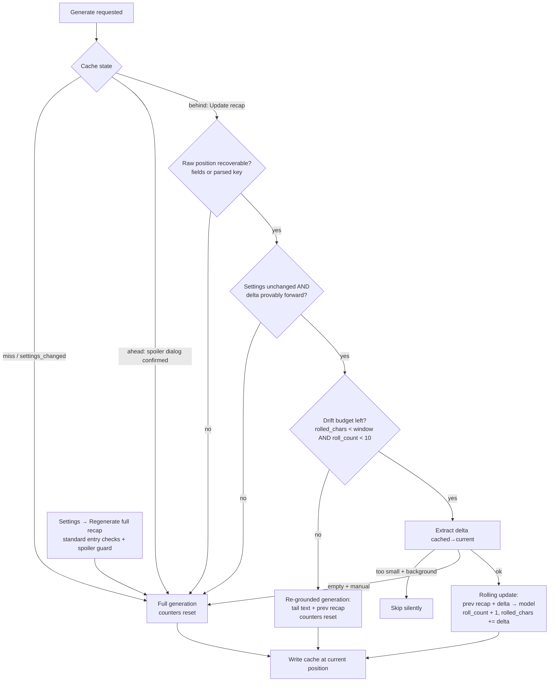

# Rolling Incremental Recaps - Plan

## Goal Capsule

- **Objective:** Turn KO Catchup's cached recap into a living summary: after the first full recap of a book, subsequent regenerations send only *previous recap + text read since*, cutting regeneration latency and token cost up to ~10× at regular update cadences and accumulating full-book coverage over time.
- **Authority:** This plan governs scope; existing repo conventions (typed errors, mock-based specs, silent background etiquette) govern idiom.
- **Execution profile:** Existing codebase, all seams established (extractor, prompts, cache, orchestration). LuaJIT; verify via `spec/runner.lua` suite plus the Ollama integration harness.
- **Stop conditions:** Surface if (a) rolled-recap quality is clearly degraded in behavioral checks and prompt tuning can't fix it, or (b) delta extraction proves unreliable for crengine xpointer ranges.
- **Tail ownership:** Implementer bumps VERSION (0.3.0) in `main.lua` and `_meta.lua`, updates README, rebuilds the release zip.

---

## Product Contract

### Summary

The first recap of a book generates exactly as today. Once a recap is cached and the reader has advanced, updating the recap extracts only the text between the cached position and the current position and asks the model to merge it into the previous recap. Backward jumps and settings changes still regenerate from scratch. A drift guard periodically re-grounds the recap against real text without discarding accumulated coverage, and a menu escape hatch lets the user force a from-scratch recap anytime. Background pre-generation shares the same decision path and generation helper.

### Requirements

**Rolling update**

- R1. When a cached recap exists at an earlier position and the reader regenerates (manual "Update recap" or background pre-generation), the request contains the previous recap plus only the delta text — never the full read-so-far text.
- R2. The updated recap preserves coverage of events from the previous recap while integrating the delta, in narrative order, at the configured length (spoiler rules unchanged: delta ends at the current position).
- R3. Rolling works for crengine and page-based documents; cache entries written by 0.2.0 (no raw position fields) are recovered when possible and otherwise fall back to a full generation, never an error.

**Full-generation fallbacks**

- R4. Full (from-scratch) generation is used for: first recap, backward-jump regeneration (existing spoiler guard), model/length settings changes (including when detected on the advanced-position path), unrecoverable legacy cache entries, and any roll whose delta cannot be proven to run forward.
- R5. Drift guard: when cumulative rolled text exceeds one extraction window (`max_input_chars`), or after 10 rolls, the next regeneration is a **re-grounded** generation — full tail-window text plus the previous recap as prior context — so accumulated pre-window coverage is preserved, never discarded. Invisible to the user beyond normal full-generation latency; both counters reset afterward.
- R6. A "Regenerate full recap" item in the Settings submenu forces a from-scratch recap at the current position. It runs the standard entry checks (configuration, minimum position, network gate), and when the cached recap covers a later position it shows the existing spoiler-guard dialog before overwriting.

**Experience**

- R7. The position-advanced dialog's confirm action is labeled "Update recap" and performs the rolling update.
- R8. Background pre-generation rolls when possible, and skips silently when the delta is trivially small (not worth tokens); a manual "Update recap" always proceeds — it rolls any non-empty delta, and falls back to a full generation when the range yields no text.

### Acceptance Examples

- AE1. Book recapped at 40%, reader now at 55%: tapping Update recap sends the 40% recap + text from 40→55% only; the new recap still mentions events from before 40%.
- AE2. Same book, reader jumps back to 30% and confirms the spoiler dialog: a full generation runs from text up to 30% (no rolling from a later-position recap).
- AE3. A cache entry written by v0.2.0 (`position = "xp:..."`, no raw fields): next update rolls by recovering the xpointer from the key.
- AE4. When rolling has accumulated more delta text than one extraction window (or 10 rolls, whichever comes first), the next update is a re-grounded generation — tail-window text plus the previous recap — and both drift counters reset to 0.

### Scope Boundaries

**Deferred to Follow-Up Work**

- Chapter-level map-reduce summarization (only revisit if rolling proves insufficient for very long books).
- Recap history (keeping prior recaps).
- Re-styling an existing recap on length-preset change without book text.

---

## Planning Contract

### Key Technical Decisions

- KTD1. **Recap-as-state, not chapter summaries.** The cached recap itself is the running summary; no new storage structures, composes with pre-generation for free. Rationale: 90% of the benefit of map-reduce at ~20% of the machinery; map-reduce stays deferred.
- KTD2. **Delta bounds come from raw positions stored in the cache entry** — `xpointer` (crengine) or `page` (paged) alongside the existing `position` identity key. Legacy 0.2.0 entries are recovered by parsing the key (`"xp:<xpointer>"` / `"page:<n>"`); parse failure → full generation (R3). crengine xpointers are DOM-based and font-independent, so a stored xpointer remains a valid range endpoint across font changes.
- KTD3. **Drift guard = rolled volume with a count backstop, refreshed by re-grounding.** Cache entries track `rolled_chars` (cumulative delta size) and `roll_count`; when `rolled_chars` exceeds one extraction window (`max_input_chars`) or `roll_count` reaches 10, the next generation is **re-grounded**: full tail-window text *plus* the previous recap as prior context (third prompt variant). Rationale: summaries-of-summaries compound small errors, but a plain full refresh is tail-window-only and would erase accumulated pre-window coverage — re-grounding refreshes against real text without forgetting; volume is the honest drift measure once per-session pre-generation makes roll counts cheap. Counters reset after any re-grounded or full generation. Paired with the R6 escape hatch for user control.
- KTD4. **Roll/reground/full is decided in one place** — a pure decision function in the orchestrator taking (cache entry, position, settings) → `roll` (with delta bounds), `reground`, or `full` (with reason), unit-testable without UI. On the `behind` path it additionally (a) re-checks `entry.model`/`entry.recap_length` against current settings, since `Cache.compare` only reports `settings_changed` at the same position, and (b) proves the delta runs strictly forward by comparing page numbers (`getPageFromXPointer` for crengine, page fields for paged); a settings mismatch or unprovable/backward direction → `full`. Existing `Cache.compare` semantics (`hit`/`ahead`/`behind`/`settings_changed`/`miss`) are unchanged; the decision layers on top of `behind`.
- KTD5. **Tiny-delta policy via a caller-supplied minimum.** The range extractor takes an optional minimum (default: the existing `MIN_CHARS`). Background pre-generation uses the default and treats `too_short` as its silent skip; manual updates pass 0 and roll any non-empty delta; a truly empty range (`no_text`) on a manual update falls back to full generation rather than surfacing the image-only error copy. Keeps background token spend honest without second-guessing explicit taps.

### High-Level Technical Design

Regeneration decision (layers on the existing cache-state flow; `hit`/`ahead`/`settings_changed`/`miss` behavior is unchanged):

### Deferred to implementation

- Exact update- and reground-prompt wording (merge/prior-context instructions, length handling) — tune against real books, same as the original prompt.
- How a roll whose previous-recap-plus-delta exceeds `max_input_chars` truncates (delta is tail-truncated today; whether to shrink the recap portion instead is an implementation-time call).

---

## Implementation Units

### U1. Range extraction in the extractor

- **Goal:** Extract text between a stored position and the current position, reusing existing flatten/truncate/UTF-8 machinery.
- **Requirements:** R1, R3.
- **Dependencies:** none.
- **Files:** `kocatchup.koplugin/kocatchup_extractor.lua`, `spec/extractor_spec.lua`.
- **Approach:** New entry point taking a `from` position (xpointer or page) and an optional minimum (`opts.min_delta_chars`, default `MIN_CHARS`) per KTD5. crengine: `getTextFromXPointers(from_xp, current_xp)` — no goto round-trip needed. Paged: pages `from_page + 1 .. current`. Same tail truncation against `max_input_chars`; returns the same typed failures (`no_text`, `too_short`).
- **Patterns to follow:** existing `extract_cre` / `extract_paged` structure and result shape.
- **Test scenarios:**
  - Covers AE1. crengine mock: range extraction passes the stored and current xpointers to `getTextFromXPointers` and returns only that text with metadata.
  - Paged mock at page 60 with `from` page 40: pages 41–60 requested, nothing earlier.
  - Delta shorter than the default minimum returns `too_short`; the same delta with a caller minimum of 0 is returned; empty range returns `no_text` regardless of minimum.
  - Oversized delta is tail-truncated on a UTF-8 boundary (reuse existing truncation cases against the range path).
- **Verification:** extractor specs green; range path never calls `gotoPos`.

### U2. Update-prompt builder

- **Goal:** Prompts for the two new generation modes: merging a previous recap with delta text (roll), and re-grounding against tail text with the previous recap as prior context (drift refresh) — spoiler rules intact in both.
- **Requirements:** R2, R5.
- **Dependencies:** none.
- **Files:** `kocatchup.koplugin/kocatchup_prompts.lua`, `spec/prompts_spec.lua`.
- **Approach:** Two builders returning the same `{system, user}` shape. `build_update(meta, prev_recap, delta_text, recap_length)`: updating an existing story-so-far recap — integrate the new text's events, preserve earlier events' coverage, narrative order, never reveal beyond the provided text, same language, target length. `build_reground(meta, tail_text, prev_recap, recap_length)` per KTD3: write a fresh recap from the provided text, using the previous recap as authoritative context for events before the provided text begins — preserve that earlier coverage, never invent beyond either source.
- **Patterns to follow:** existing `Prompts.build` structure and the length-preset table.
- **Test scenarios:**
  - Update builder: output contains the previous recap, the delta text, and a merge/update instruction with preserve-earlier-coverage wording.
  - Reground builder: output contains the tail text, the previous recap, and the prior-context/preserve-coverage instruction.
  - Both: no-spoiler and same-language instructions present; length preset respected and falls back to standard; missing metadata degrades without errors (mirror existing case).
- **Verification:** prompts specs green.

### U3. Cache schema v2 with legacy recovery

- **Goal:** Cache entries carry raw position fields and a roll counter; 0.2.0 entries remain readable and recoverable.
- **Requirements:** R3, R5 (storage half).
- **Dependencies:** none.
- **Files:** `kocatchup.koplugin/kocatchup_cache.lua`, `spec/cache_spec.lua`.
- **Approach:** Entries gain `xpointer` or `page`, plus `roll_count` and `rolled_chars` (both default 0 when absent). New helper returning the rollable raw position for an entry: prefer explicit fields, fall back to parsing the `position` key, nil when unrecoverable. `Cache.compare` unchanged.
- **Test scenarios:**
  - Covers AE3. Legacy entry (`position = "xp:abc"`, no raw fields): helper returns the parsed xpointer; malformed key returns nil.
  - New-schema round-trip preserves `xpointer`/`page`/`roll_count`/`rolled_chars`; absent counters read as 0.
  - Existing compare cases still pass untouched (regression).
- **Verification:** cache specs green, including all pre-existing cases.

### U4. Orchestration: roll/full decision, dialogs, escape hatch, pre-generation

- **Goal:** Wire rolling into manual and background generation with the KTD4 decision function, the relabeled dialog, and the Settings escape hatch.
- **Requirements:** R1, R4, R5, R6, R7, R8.
- **Dependencies:** U1, U2, U3.
- **Files:** `kocatchup.koplugin/main.lua`, `spec/main_spec.lua`, `spec/integration_ollama.lua`.
- **Approach:** Pure decision function per KTD4 (roll / reground / full, with the behind-path settings re-check and forward-direction proof); `doGenerate` gains a mode; rolls write `roll_count + 1` and `rolled_chars + #delta`, re-grounds and fulls reset both to 0. Extract the shared prompt-selection + cache-entry-construction into one helper used by both `doGenerate` and `pregenerate` so the two write sites cannot drift. The behind-state ConfirmBox confirm becomes "Update recap" → decision path (body text kept consistent with the new label). "Regenerate full recap" appended to the Settings submenu (built in `main.lua`, where the plugin instance is in scope): runs the standard entry pipeline (config check, minimum-position check, network gate) with the decision forced to full, and shows the existing spoiler-guard ConfirmBox first when the cache is in the ahead state. Manual roll path passes `min_delta_chars = 0` and maps `no_text` to a full-generation fallback per KTD5; `pregenerate` keeps the default minimum and skips silently on `too_short`.
- **Test scenarios:**
  - Covers AE1 e2e: behind state + Update → transport request contains the previous recap and delta marker text, and does **not** contain early-book text outside the delta; cache written at the new position with `roll_count` incremented and `rolled_chars` grown by the delta size.
  - Covers AE4. Entry with `rolled_chars` over the window (and separately `roll_count = 10`): update performs a re-grounded generation (transport receives tail text AND the previous recap; both counters reset to 0).
  - Covers AE2. Ahead state confirmed: full generation (unchanged, regression).
  - Legacy entry without raw fields but parseable key: rolls; with unparseable key: full.
  - Settings-changed at same position: full generation (regression). Behind entry with a different `recap_length`: full generation (behind-path settings re-check).
  - Behind-classified entry whose raw position is at or after the current position: full generation (forward-direction proof).
  - Manual update with a one-page delta (under `MIN_CHARS`): rolls anyway (minimum 0). Manual update with an empty range: full-generation fallback, no image-only error message.
  - "Regenerate full recap": forces full generation on a same-position cache hit; with an ahead-state cache it shows the spoiler ConfirmBox before generating; with no API key it shows the standard config message (entry pipeline).
  - Pre-generation with a rollable behind entry: transport receives the rolling prompt; with a tiny delta: no transport call, no UI (silent skip).
  - Error paths unchanged: roll-path provider failure shows the existing typed messages and leaves the old cache entry intact.
- **Verification:** full suite green; the roll-path request body is asserted to be a small fraction of the full-path body in the e2e scenario.

### U5. Docs and version

- **Goal:** README reflects rolling behavior; version bumped for release.
- **Requirements:** R2, R5, R6 (user-facing descriptions), tail ownership.
- **Dependencies:** U4.
- **Files:** `README.md`, `kocatchup.koplugin/main.lua`, `kocatchup.koplugin/_meta.lua`.
- **Approach:** README: updates are incremental (fast and cheap at regular update cadences — a long reading gap costs like a full generation), coverage accumulates as you read — soften the long-book limitation accordingly; document the re-grounding drift guard and "Regenerate full recap". Bump VERSION to 0.3.0 in both files (sync test already enforces the pair).
- **Test expectation:** none — docs and version metadata; the existing version-sync unit test covers the bump.
- **Verification:** README accurately describes shipped behavior; suite green.

---

## Verification Contract

| Gate | Command / procedure | Applies to |
|---|---|---|
| Unit tests | `luajit spec/runner.lua` (busted-compatible; `busted spec` where available) | U1–U4 |
| Integration | `luajit spec/integration_ollama.lua` — full-generation regression; extend with a second rolling call (previous recap + delta) against live Ollama | U4 |
| Device smoke (user) | Generate a recap mid-book, read a few pages, Update recap: visibly faster than the first generation; recap retains pre-update events | U4 |

Behavioral quality bar: on a familiar book, an updated recap must still describe events from before the previous recap's position (coverage preserved) and nothing past the current position (spoiler rule).

## Definition of Done

- U1–U5 complete; full suite green (existing 55 scenarios plus the new ones).
- Integration harness demonstrates a real rolling update against Ollama with a request body materially smaller than the full-generation body.
- Legacy-cache compatibility proven by test (0.2.0-shaped entry rolls or falls back, never errors).
- README updated; VERSION 0.3.0 in both files; release zip rebuilt.
- No dead code; no secrets committed.

---

## Risks & Dependencies

- **Rolled-recap quality drift** — compounding summarization errors, and a single bad merge propagates until the next refresh. Mitigated by the volume-based re-grounding guard (KTD3), the escape hatch (R6), and the behavioral quality bar; prompt wording is the tuning knob.
- **Merge-prompt quality on small models** — local Ollama models may under-merge (drop old events) or over-focus on the delta. Mitigated by explicit preserve-coverage instruction and the integration-harness check; worst case the drift guard's full refresh corrects it.
- **Legacy entry recovery** relies on the stable `"xp:"`/`"page:"` key format this codebase has always written; the parse is defensive and falls back to full generation.
