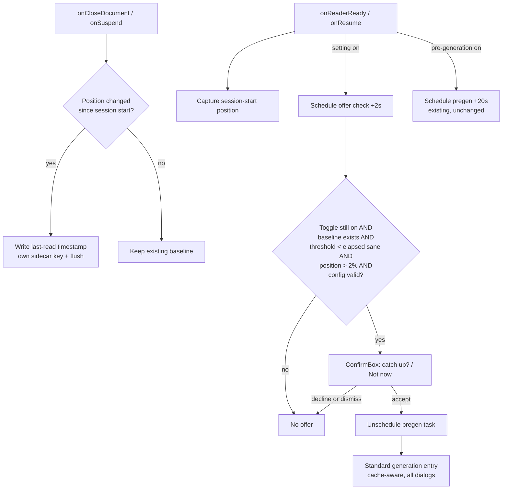

# Auto-Offer Catch-Up on Reopen - Plan

## Goal Capsule

- **Objective:** The Kindle-parity moment: reopening a book after a real break offers a catch-up recap — opt-in, one dialog, never auto-showing anything. Pairs with pre-generation and rolling updates so accepting is usually instant.
- **Authority:** This plan governs scope; repo conventions (typed errors, mock specs, background etiquette) govern idiom.
- **Execution profile:** Existing codebase; all seams established (`onReaderReady`/`onCloseDocument` hooks, scheduling mocks, settings menu, cache sidecar). Verify via `spec/runner.lua`.
- **Stop conditions:** Surface if `onCloseDocument` proves unreliable as a timestamp write point (e.g., not fired on app exit paths) and no equivalent close-time hook exists.
- **Tail ownership:** Implementer bumps VERSION (0.4.0) in `main.lua` + `_meta.lua`, updates README, rebuilds the release zip.

---

## Product Contract

### Summary

Whenever a reading session ends — the book closes **or the device suspends** — the plugin records a last-read timestamp in that book's sidecar, but only when the position moved during the session, so trivial peeks never erase a real break. On reopen **or resume** with the **"Offer catch-up after a break"** setting enabled, if the reader has been away longer than the configured threshold and is past the start of the book, a dialog asks whether to catch up. Accepting cancels any pending background pre-generation and runs the standard generation entry — cached or pre-generated recaps show instantly; otherwise normal generation with its usual prompts. Declining (button or tap-outside) does nothing and persists nothing; because an unread session preserves the baseline, the offer naturally returns at the next qualifying open or resume.

### Requirements

- R1. A per-device, opt-in setting "Offer catch-up after a break" (default off) with a break-threshold choice of 1, 3, or 7 days (default 3), in the existing Settings submenu.
- R2. The plugin records a last-read timestamp in the book's sidecar when a session ends — on document close **and on device suspend** — regardless of the toggle, but **only when the reading position changed during the session**; a session with no progress (a quick peek, a declined offer) preserves the existing baseline.
- R3. On reopen **and on resume** with the setting enabled, the offer dialog appears only when all of: the toggle is still enabled at fire time, a baseline timestamp exists, the elapsed time exceeds the threshold **and is positive and sane** (clock jumps and dead-RTC values → no offer), the position is past the existing 2% too-early gate, and the provider configuration is valid (an offer that leads to an error message is worse than silence). Accepting cancels any pending pre-generation task and invokes the standard generation entry with all its cache states and dialogs; declining — the "Not now" button or any dismissal — persists nothing.
- R4. The offer never fires on a book's first-ever open (no baseline), never auto-shows a recap without an explicit tap, and fires at most once per open/resume event — the threshold, not a nag counter, is what keeps it infrequent.
- R5. README documents the setting and its interplay with pre-generation.

### Acceptance Examples

- AE1. Setting on (3-day threshold), book closed 5 days ago, reader at 40%, recap cached at the current position: reopen → offer appears; tapping "Catch up" shows the cached recap instantly, no network activity.
- AE2. Same setup, book closed yesterday: no offer.
- AE3. First session after installing 0.4.0: no offer (no baseline); a session with reading progress writes the baseline, so the next qualifying break offers.
- AE4. Setting off (default): no offer ever; session-end timestamps are still recorded.
- AE5. Device suspended with the book open, resumed 6 days later: offer appears on resume — the dominant e-ink break path.
- AE6. Real baseline 10 days old; yesterday the reader opened the book for 30 seconds without turning a page and closed it: today's reopen still offers (the trivial session preserved the 10-day baseline).

### Scope Boundaries

- The offer is a question, never an auto-shown recap.
- No "book nearly finished" suppression — a pre-finale catch-up is a legitimate use.

**Deferred to Follow-Up Work**

- Snooze/"don't ask again for this book" option on the dialog.
- Using reading-statistics data (KOReader stats plugin) as a richer away-time signal.

---

## Planning Contract

### Key Technical Decisions

- KTD1. **Own sidecar timestamp, written on session end with progress, not filesystem access times.** The Assistant plugin's equivalent keys on `lfs.attributes(file).access`, unreliable on modern `noatime` mounts. Writing `os.time()` under a plugin-namespaced sidecar key on `onCloseDocument` **and `onSuspend`** is exact, self-contained, and free — and suspend coverage is load-bearing: on e-ink, suspending with the book open is the dominant way breaks happen. The write is **progress-conditional**: the session-start position is captured at open/resume, and the timestamp is written only if the position differs at session end — so trivial peeks and declined offers never erase a real break. Stored as its own key (independent of the recap entry lifecycle). Cost: no offer until one progressed session has been recorded (AE3).
- KTD2. **The offer routes through the existing generation entry** (`onKoCatchupGenerate`), not a parallel path. All cache states, the spoiler guard, Wi-Fi prompting, and rolling updates are reused for free; a cached/pre-generated recap makes acceptance instant. Accepted trade-offs, both explicit: (a) in rare states a second dialog follows acceptance (e.g., the backward-jump spoiler guard); (b) accepting offline with no cache leads to the Wi-Fi prompt, and declining that prompt ends silently (existing `runWhenOnline` semantics) — covered by a test so it stays a decision, not an accident.
- KTD3. **Offer timing: scheduled ~2 seconds after `onReaderReady` and after `onResume`,** well before pre-generation's 20s; unscheduled on close/suspend (own task handle, same pattern as `_pregen_task`). All guards — including the toggle itself — re-evaluate at fire time. **Accepting the offer unschedules the pending pre-generation task**: otherwise a foreground generation started at ~3s races the 20s pre-gen fire (which checks cache state, not in-flight work) into a duplicate concurrent paid generation. Left scheduled on decline and while the dialog is open, so a pre-gen completing behind the dialog makes acceptance instant.

### High-Level Technical Design

---

## Implementation Units

### U1. Last-closed tracking and settings

- **Goal:** Persist and read the per-book last-closed timestamp; add the two settings and their menu items.
- **Requirements:** R1, R2.
- **Dependencies:** none.
- **Files:** `kocatchup.koplugin/kocatchup_cache.lua`, `kocatchup.koplugin/kocatchup_settings.lua`, `spec/cache_spec.lua`, `spec/llm_spec.lua`.
- **Approach:** Cache module gains a touch/read pair for a `kocatchup_last_read` sidecar key. The touch **must call `doc_settings:flush()`** (the `Cache.write` pattern) — this is load-bearing, not stylistic: KOReader's ReaderUI flushes the sidecar *before* broadcasting the close event, so an unflushed write at close time is silently lost on-device while every mock-based test stays green. Settings defaults gain `auto_offer = false` and `auto_offer_days = 3`; menu gains a checked toggle whose help text states the warm-up ("the first offer can appear after your next reading session") and a 1/3/7-day radio picker, following the existing `auto_generate` and `recap_length` item patterns.
- **Patterns to follow:** `Cache.write`'s explicit-flush pcall style; `choice_items` and the `auto_generate` toggle in `kocatchup_settings.lua`.
- **Test scenarios:**
  - Timestamp round-trip through the DocSettings mock **with an assertion that `flushed > 0` after the touch** (pins the load-bearing flush); absent key reads nil; corrupt value reads nil.
  - Settings defaults include `auto_offer = false`, `auto_offer_days = 3`; round-trip preserves them.
- **Verification:** cache and settings specs green, including the flush assertion.

### U2. Offer flow on reopen

- **Goal:** Session-end timestamp writes (close and suspend, progress-conditional), the scheduled offer check on reopen and resume, its guard chain, the dialog, and safe coexistence with pre-generation.
- **Requirements:** R2 (hook half), R3, R4. Covers the offer flow (S → G → D/Q → U → E) in the HTD diagram.
- **Dependencies:** U1.
- **Files:** `kocatchup.koplugin/main.lua`, `spec/main_spec.lua`, `spec/helper.lua`.
- **Approach:** `onReaderReady` and `onResume` capture the session-start position, then schedule the offer task at ~2s when `auto_offer` is on (own task handle alongside `_pregen_task`). `onCloseDocument` and `onSuspend` write the timestamp **only when the current position differs from the session-start position**, then unschedule both tasks (suspend leaves pregen unscheduled too — it reschedules on resume). The fired check re-loads settings and applies the full R3 guard chain, including the toggle re-check (matching `pregenerate`'s fire-time pattern) and the elapsed-sanity guard (non-positive or absurd elapsed → no offer). On pass: ConfirmBox "You've been away from this book for a while. Catch up on the story so far?", ok "Catch up", cancel "Not now"; any dismissal is a decline, nothing persisted. The ok_callback **unschedules `_pregen_task` first**, then calls `onKoCatchupGenerate()`. Extend `spec/helper.lua` with a delay-filtered `H.fire_scheduled(max_delay_s)` so interleaving scenarios can fire the 2s offer while leaving the 20s pregen queued (delays are already recorded).
- **Execution note:** offer-dialog scenarios that don't test coexistence should run with `auto_generate` off; the interleaving scenario is the one that needs the delay-filtered helper. Verify `onSuspend`/`onResume` event names against KOReader's broadcast events during implementation (statistics plugin is the reference consumer).
- **Test scenarios:**
  - Covers AE1. Setting on, baseline 5 days old, position 50%, cached recap current: fire → ConfirmBox with ok "Catch up" / cancel "Not now"; accept → TextViewer with the cached recap, zero transport calls, zero Wi-Fi prompts.
  - Covers AE2. Baseline 1 day old (3-day threshold): fire → no dialog. Threshold picker respected: 7-day setting, 5-day break → no offer.
  - Covers AE3. No baseline: fire → no dialog; a session with position change writes the timestamp on close.
  - Covers AE4. Setting off: no offer task scheduled; close (with progress) still writes the timestamp.
  - Covers AE5. `onResume` schedules the offer check; with a 6-day-old baseline it offers; `onSuspend` (with progress) writes the timestamp.
  - Covers AE6. Session with no position change: close/suspend preserves the existing baseline (old timestamp still present afterward).
  - Config invalid → no dialog; position at 1% → no dialog; elapsed negative (baseline in the future) → no dialog.
  - Coexistence: both features on → two tasks scheduled; `H.fire_scheduled(2)` fires only the offer; accepting unschedules the pregen task — assert exactly one transport call and an empty schedule afterward. Close/suspend unschedules both.
  - Accept-offline acknowledgment: no cache, `H.network_online = false` → accept leads to the Wi-Fi gate path with no widget shown and no cache write (documents KTD2's trade-off).
- **Verification:** main specs green; the offer path shows no widget other than the ConfirmBox unless accepted; exactly one generation ever runs per accepted offer.

### U3. Docs and version

- **Goal:** README documents the feature; version bumped for release.
- **Requirements:** R5, tail ownership.
- **Dependencies:** U2.
- **Files:** `README.md`, `kocatchup.koplugin/main.lua`, `kocatchup.koplugin/_meta.lua`.
- **Approach:** Features bullet + settings-table rows (both new settings); note the pairing with pre-generation ("enable both and the catch-up is usually already waiting"); note the one-session baseline warm-up. Bump VERSION to 0.4.0 in both files.
- **Test expectation:** none — docs and version metadata; the version-sync unit test covers the bump.
- **Verification:** README matches shipped behavior; suite green.

---

## Verification Contract

| Gate | Command / procedure | Applies to |
|---|---|---|
| Unit tests | `luajit spec/runner.lua` (busted-compatible) | U1–U3 |
| Integration | `luajit spec/integration_ollama.lua` — unchanged, regression only | — |
| Device smoke (user) | Enable the setting; test both paths (temporarily set a 1-day threshold): (a) close a book, reopen after the threshold — offer appears once; (b) suspend with the book open, resume after the threshold — offer appears on resume. Accept shows a recap; "Not now" stays quiet; a 30-second peek doesn't reset the break | U2 |

## Definition of Done

- U1–U3 complete; full suite green (81 existing scenarios plus the new ones).
- Offer guard chain fully covered by tests (all eight U2 scenarios).
- README updated; VERSION 0.4.0 in both files; release zip rebuilt.
- No dead code; no secrets committed.

---

## Risks & Dependencies

- **Session-end hook reliability** — crash and power-off paths skip both close and suspend hooks, leaving the baseline stale by one session; consequence is a missed or late offer, never a wrong one. Suspend coverage (KTD1) removes the dominant gap; the stop condition covers systematic failure.
- **`onSuspend`/`onResume` event contract** — assumed from KOReader's broadcast events (statistics plugin consumes them); verified during implementation and device smoke. If resume events prove unreliable on some platform, the feature degrades to close/reopen-only there.
- **Dialog fatigue** — mitigated by opt-in default-off, the at-most-once-per-open/resume schedule, threshold gating, and no persistence of declines (no nag state to get wrong).
