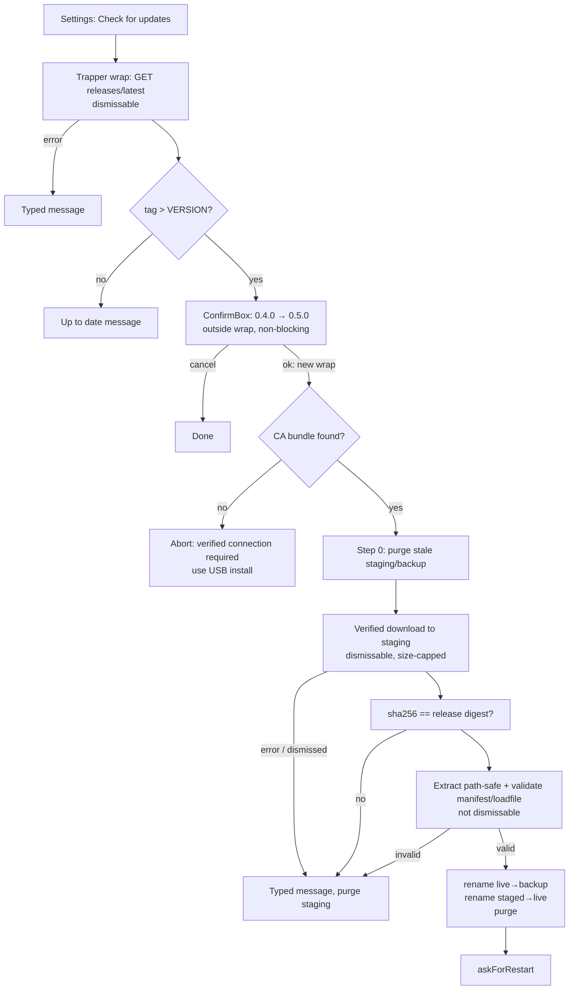

# Wi-Fi Self-Updater - Plan

## Goal Capsule

- **Objective:** A manual "Check for updates" action that fetches this repo's latest GitHub release over Wi-Fi and installs it safely on-device, removing the USB update dance for every user on every release.
- **Authority:** This plan governs scope; the parked research (`docs/research/2026-08-10-wifi-updater-research.md`, verified against KOReader and precedent-plugin source) governs mechanism facts; repo conventions govern idiom.
- **Execution profile:** Existing codebase. Unit tests via `spec/runner.lua`; a real download check can run on Windows through the curl harness; extraction/swap logic is device-only (mocked in tests, smoked on-device).
- **Stop conditions:** Surface if `ffi/archiver` proves absent or incompatible on the target KOReader build, or if the safe-swap invariant (live install untouched until a validated copy exists) cannot be honored on some platform.
- **Tail ownership:** Implementer bumps VERSION (0.5.0), updates README, and lands the release CI workflow (KTD6); from 0.5.0 onward, tagging `vX.Y.Z` builds and attaches `kocatchup-X.Y.Z.zip` automatically, so release discipline is machine-enforced rather than manual.

---

## Product Contract

### Summary

Settings gains **"Check for updates"**. Tapping it queries the repo's latest GitHub release and compares against the installed version. Up to date → a quiet confirmation. Newer → a dialog showing current → new version; confirming downloads the release zip over verified TLS, checks it against the release's published sha256 digest, extracts it into a staging area with path-traversal protection, validates a complete plugin folder there, atomically swaps it into place, and prompts for the KOReader restart. Every failure leaves the installed plugin untouched and shows a typed, actionable message. The updater downloads executable code, so it **refuses to proceed without verified TLS** — no unverified fallback.

### Requirements

**Check and install**

- R1. "Check for updates" in the Settings submenu queries `releases/latest` for this repo and compares `tag_name` (stripped of `v`) against `KoCatchup.VERSION` by semantic-version order.
- R2. Up to date → an InfoMessage stating the installed version is current. Newer → a ConfirmBox showing installed and available versions; only explicit confirmation downloads anything.
- R3. Install pipeline, in order: **purge any leftover staging/backup from a prior interrupted run** (recovery step 0); download the release asset `kocatchup-X.Y.Z.zip` to a staging area that is a **sibling of the live plugin directory** (guaranteeing same-filesystem atomic `os.rename` on every platform); verify the download against the release asset's sha256 digest; extract with `ffi/archiver`, rejecting any entry whose path is absolute or contains `..`; **validate before touching the live install** — the staged folder must contain every module the running install ships (an explicit manifest), and each staged `.lua` file must `loadfile` cleanly (catches truncation) without being executed, and the staged `_meta.lua` version (read as text, never loaded) must match the release tag. Then: rename live → backup, rename staged → live, purge staging and backup. Prompt restart via `UIManager:askForRestart()`.
- R4. Any failure — network, HTTP error, missing asset, digest mismatch, path-traversal entry, extraction failure, validation failure — and any user cancellation (SIGKILL leaves no cleanup, so the next run's step-0 purge reclaims it) aborts before the first rename and shows a typed message, leaving the installed plugin untouched. The two renames are the only critical window; a failure between them restores the backup, and step 0 reclaims a stale backup if a crash prevented that.

**Security**

- R5. Both the API call and the asset download require verified TLS against the CA bundle (existing discovery in `kocatchup_llm.find_ca_bundle`). The verification must survive GitHub's cross-host redirect — see KTD2. If no CA bundle is found, or a certificate verification fails, the updater aborts with a typed message pointing to manual (USB) install; it never downloads executable code over an unverified connection. (KOReader ships `data/ca-bundle.crt` on all real devices, so this is a dev/desktop edge, not a routine path.)
- R6. Integrity is checked at two layers: the sha256 digest pins the exact bytes across the redirect chain, and manifest + `loadfile` validation proves the staged copy is complete and parseable. Nothing is written outside the staging area and the plugin's own folder — extraction rejects traversal paths, and no downloaded file is ever executed before the swap (validation reads `_meta.lua` as text). Download and cumulative extraction are size-capped to bound a hostile or corrupt archive.

**Experience and lifecycle**

- R7. The check and download run in the established Trapper pattern: dismissable progress messages, tap-to-cancel during network phases; extraction and swap are deliberately not dismissable.
- R8. Settings and cached recaps survive updates by construction (they live outside the plugin folder); the README says so.
- R9. Update checks happen only on explicit tap — no automatic phoning home, documented in the README privacy section.

### Acceptance Examples

- AE1. Installed 0.4.0, latest release v0.5.0: check → "0.4.0 → 0.5.0 available" dialog → confirm → progress → "Update installed" + restart prompt; after restart the plugin reports 0.5.0 with settings intact.
- AE2. Installed version equals the latest tag: check → "KO Catchup 0.5.0 is up to date." No download.
- AE3. Download interrupted (Wi-Fi drops mid-transfer): typed network message, staging purged, installed plugin untouched and fully functional.
- AE4. Release exists but the zip asset is missing, the download's sha256 doesn't match the release digest, the archive carries a `..` entry path, a staged module is missing or truncated (fails `loadfile`), or `_meta.lua`'s text version ≠ tag: typed message, no rename performed.
- AE5. No CA bundle found (or a certificate verification failure): the updater aborts before downloading with a message pointing to manual install — never a proceed-anyway prompt.
- AE6. A prior update was interrupted, leaving a stale staging/backup directory: the next Check-for-updates run purges them at step 0 and proceeds normally (or, if the live folder is absent, restores the backup first).

### Scope Boundaries

- Stable releases only, from this one repo; no pre-release channel, no arbitrary-URL updates.
- Manual tap only — no scheduled or startup checks.

**Deferred to Follow-Up Work**

- Automatic update checks (badge or notification on open).
- Delta/differential updates; release-notes display in the update dialog.
- Hostname verification beyond chain validation (LuaSec's https helper validates the chain but not the hostname; accepted upstream limitation, layered under the digest check).

---

## Planning Contract

### Key Technical Decisions

- KTD1. **Download the release asset, not the source archive.** Precedent plugins pull `archive/refs/tags/{tag}.zip`, but our repo zip would drag in `spec/`, `docs/`, and `_koreader/`; the asset `kocatchup-X.Y.Z.zip` contains exactly `kocatchup.koplugin/` at its top level. GitHub answers the asset URL with a cross-host 302 (github.com → objects.githubusercontent.com); KOReader's pinned luasocket follows it, but redirect handling interacts with TLS verification — see KTD2.
- KTD2. **Verified TLS that survives the redirect, via an explicit `create` factory — no unverified fallback (R5).** Reuse `find_ca_bundle`. The subtlety (verified against the pinned luasocket source): passing `verify`/`cafile` as request-table *fields* works for a single-host request but is **dropped on GitHub's cross-host redirect** — luasocket's `tredirect` carries only `create` to the next hop, and the field-based path sets `create` on an internal copy, so the redirected asset hop silently falls back to LuaSec's `verify="none"`. The fix is to pass an explicit `create = ssl.https.tcp{ verify="peer", cafile=<bundle>, protocol="any", options={"all","no_sslv2","no_sslv3"} }` on the caller's request table, so the TLS-parameterized factory rides every hop. Requests use `socket.http` + `socketutil` file-sink timeouts (GET), distinct from the LLM transport. No CA bundle or a verification failure → abort with a typed message, never a consent-to-proceed prompt.
- KTD3. **Recover, then validate-everything, then two renames (R3/R4).** Staging and backup are **siblings of the live plugin directory** (derive the plugin's own path from the loader-set instance field), guaranteeing same-filesystem atomic `os.rename` on every platform — `DataStorage:getDataDir()` can be a different mount than the plugins dir on desktop/Android. Backup and staging directory names must **not** end in `.koplugin` (e.g. `kocatchup.staging`, `kocatchup.bak`), or KOReader's loader would load the backup as a second live plugin. Step 0 purges any leftover staging/backup before starting; the live install is untouched until a fully validated staged copy exists; the backup is kept until the swap succeeds, then purged. Completeness proof is the manifest + `loadfile` check, not the version string alone.
- KTD4. **Updater is a separate module (`kocatchup_updater.lua`) with injectable transport, archiver, hasher, and fs seams,** mirroring `Llm.transport`: version comparison, release-JSON parsing (including the asset `digest`), URL selection, and pipeline sequencing are pure and unit-tested; the device-only pieces (`ffi/archiver`, `ffi/sha2`, real filesystem swap) sit behind seams the specs stub — including one fs-fidelity spec giving the rename seam real semantics (rename onto a non-empty dir → error). A real-download check runs through a GET-capable curl harness.
- KTD5. **Semver comparison is numeric on major.minor.patch,** ignoring pre-release suffixes (out of scope per R1/Scope; `releases/latest` excludes prereleases by API contract anyway). Malformed tags compare as not-newer (fail safe: no phantom update offers).
- KTD6. **Machine-enforced release discipline.** A tag-triggered GitHub Actions workflow (`vX.Y.Z` push) verifies `main.lua`/`_meta.lua` VERSION equals the tag, builds `kocatchup-X.Y.Z.zip` from the tagged tree, and attaches it to the release — so a forgotten or misnamed asset (which would make every user's check fail `no_asset`, or download-then-`validate_failed`) becomes impossible rather than a human checklist item.

### High-Level Technical Design

The flow splits at the version dialog: the API check runs inside one `Trapper:wrap`; the ConfirmBox is shown *outside* any wrap (KOReader ConfirmBox is non-blocking), and its ok_callback opens a fresh `Trapper:wrap` for the download-and-swap pipeline — matching the existing `generate` flow's ConfirmBox→callback→wrap structure.

### Deferred to implementation

- Exact staging/backup directory names (constrained by KTD3: siblings of the live folder, not `*.koplugin`) and the user-facing message text for the typed errors enumerated in U1 (`http_error`, `no_asset`, `download_failed`, `digest_mismatch`, `unsafe_entry`, `extract_failed`, `validate_failed`, `tls_unavailable`) — follow the existing `error_message` pattern.
- The download/extract size cap value (generous vs the ~50 KB real asset, e.g. 20 MB).

---

## Implementation Units

### U1. Updater core: version compare, release parsing, pipeline (pure logic)

- **Goal:** `kocatchup_updater.lua` with unit-testable core: semver compare, release-JSON parsing (version + asset URL + digest), and the recovery-then-validate-then-swap pipeline over injectable seams.
- **Requirements:** R1, R3, R4, R6, KTD4, KTD5.
- **Dependencies:** none.
- **Files:** `kocatchup.koplugin/kocatchup_updater.lua`, `spec/updater_spec.lua`.
- **Approach:** Pure functions: `is_newer(remote, local)`; `parse_release(decoded)` → {version, asset_url, digest} picking the `kocatchup-*.zip` asset (nil when absent); `meta_version(text)` extracting the version by pattern from `_meta.lua` text (never `load`); `unsafe_entry(path)` flagging absolute or `..` paths. Pipeline steps return typed errors (`http_error`, `no_asset`, `download_failed`, `digest_mismatch`, `unsafe_entry`, `extract_failed`, `validate_failed`). Manifest is an explicit module list (the plugin's own `.lua` files, enumerated next to VERSION). Seams: `Updater.transport` (contract of `Llm.transport`), `Updater.archiver` (open/iterate/extract), `Updater.hasher` (bytes→sha256hex), `Updater.fs` (rename/purge/exists/loadcheck) — bound at runtime to `socket.http`+`socketutil` (with the KTD2 `create` factory), `ffi/archiver`, `ffi/sha2`, `os.rename`+`ffi/util`.
- **Execution note:** the pure functions and pipeline sequencing are the testable core; keep the KTD2 `create`-factory transport thin and out of the seam under test.
- **Test scenarios:**
  - Semver: 0.5.0>0.4.0, 0.4.1>0.4.0, 1.0.0>0.9.9, equal → false, malformed tag → false (Covers KTD5).
  - `parse_release`: picks the `kocatchup-*.zip` asset among several and returns its digest; missing asset → `no_asset` (Covers AE4).
  - `meta_version` parses `version = "0.5.0"` from text and does not evaluate the chunk (a `_meta.lua` text with a side-effecting body is never run); `unsafe_entry` flags `../x`, `/abs`, `a/../b` and passes `kocatchup.koplugin/main.lua`.
  - Digest: downloaded bytes whose sha256 ≠ release digest → `digest_mismatch`, no extract, staging purged (Covers AE4).
  - Manifest/loadfile: staged folder missing any manifest module, or a staged file that fails the loadcheck seam → `validate_failed`, no rename (Covers AE4).
  - Pipeline order with spies: happy path → step-0 purge, then renames live→backup then staged→live, then purge (Covers AE1 mechanics); download failure/dismissal → typed error, staging purged, no extract, no rename (Covers AE3); any pre-rename failure → zero rename calls.
  - Recovery: pipeline invoked with pre-existing staging+backup dirs still succeeds (step 0 purges them); **fs-fidelity spec** — a rename seam with real semantics (rename onto a non-empty dir → error) proves step 0 is what prevents the wedge (Covers AE6).
- **Verification:** updater specs green; no seam reaches real network/fs/crypto in unit tests; the irreversible rename seam is never called before validation in any scenario.

### U2. UI flow and menu wiring

- **Goal:** The user-facing check flow per the HTD diagram, wired into Settings.
- **Requirements:** R2, R5 (abort-on-no-TLS half), R7, R9; AE1, AE2, AE3, AE5.
- **Dependencies:** U1.
- **Files:** `kocatchup.koplugin/main.lua`, `kocatchup.koplugin/kocatchup_updater.lua` (runtime bindings), `spec/main_spec.lua`, `spec/helper.lua`.
- **Approach:** "Check for updates" appended to the Settings submenu (after "Regenerate full recap"). Two-phase structure matching the existing `generate` flow: **Phase 1** — `Trapper:wrap` around the API call in `dismissableRunInSubprocess`; up-to-date → InfoMessage; newer → exit the wrap and show a ConfirmBox (both version strings, "Update"/"Not now"). **Phase 2** (ConfirmBox ok_callback) — probe `Llm.find_ca_bundle`; nil → typed `tls_unavailable` InfoMessage and stop (no download); otherwise open a **new** `Trapper:wrap` running the U1 pipeline (download dismissable; digest/extract/validate/swap not dismissable); success → `UIManager:askForRestart` (pcall-guarded). Every typed error maps to a distinct message via the `error_message` pattern. Add a recording `askForRestart` stub to `spec/helper.lua`'s UIManager mock (plus `H.restart_prompts` and reset) so the happy path asserts the real prompt, not the pcall fallback.
- **Test scenarios:**
  - Covers AE2. Release equal to VERSION → InfoMessage "up to date"; no download seam call.
  - Covers AE1. Newer release → ConfirmBox shows both version strings; ok_callback with `find_ca_bundle` stubbed to a path → pipeline seams run in order, `H.restart_prompts` non-empty.
  - Covers AE5. `find_ca_bundle` → nil: ok_callback shows the `tls_unavailable` message and calls no download seam.
  - Covers AE3. Download seam failure mid-pipeline → typed InfoMessage, fs purge spy called, no rename spy call.
  - Menu: Settings submenu's last item is "Check for updates".
  - API error (403 rate-limited) → typed message, nothing else.
- **Verification:** main specs green; rename seam calls occur exclusively after validation in every scenario; no download seam runs when the CA bundle is absent.

### U3. Release CI, real-download harness, docs, version

- **Goal:** Machine-enforce release discipline; prove the real GitHub path minus device-only extraction; document; bump.
- **Requirements:** R8, R9 (README), KTD6, tail ownership.
- **Dependencies:** U1, U2.
- **Files:** `.github/workflows/release.yml`, `spec/integration_updater.lua`, `README.md`, `kocatchup.koplugin/main.lua`, `kocatchup.koplugin/_meta.lua`.
- **Approach:** **CI (KTD6):** a workflow on `v*` tag push that fails unless `main.lua` and `_meta.lua` VERSION equal the tag, then zips `kocatchup.koplugin` as `kocatchup-<tag>.zip` and attaches it to the release (`gh release upload` or `softprops/action-gh-release`). **Harness:** a GET-capable curl transport (the Ollama harness's is POST-only) calls the real `releases/latest`, parses it with the real `parse_release`, downloads the real asset, checks its sha256 against the parsed digest, and confirms the archive contains `kocatchup.koplugin/main.lua` via host-side unzip (`ffi/archiver` is device-only). **README:** in-app update path, privacy note ("update checks contact github.com only when you tap Check for updates"), and USB as the recovery path if an update is interrupted. VERSION → 0.5.0 both files.
- **Test scenarios:** the harness is the scenario (real API + digest check + archive listing). `Test expectation: none` beyond the harness for the CI/doc/version edits — the version-sync unit test covers the bump.
- **Verification:** harness passes against the live repo; the workflow file is valid and its version-guard logic is correct by inspection (first real exercise is the 0.5.0 tag); README accurate.

---

## Verification Contract

| Gate | Command / procedure | Applies to |
|---|---|---|
| Unit tests | `luajit spec/runner.lua` | U1, U2 |
| Real-download harness | `luajit spec/integration_updater.lua` — live GitHub API + digest check + host-side archive inspection | U3 |
| Regression | `luajit spec/integration_ollama.lua` | — |
| Device smoke (user) | With 0.4.0 on the Kindle and 0.5.0 released: Settings → Check for updates → confirm → restart → verify 0.5.0 with settings/recaps intact; then the up-to-date path. Recovery drill: cancel a download mid-transfer, then run Check-for-updates again and confirm it still works (step-0 purge) | U2, U3 |

## Definition of Done

- U1–U3 complete; full suite green (92 existing + new scenarios); real-download harness passes against the live repo.
- Every failure path — including digest mismatch, unsafe entry, truncated module, cancellation, and stale staging/backup — proven by test to leave the installed plugin untouched.
- Verified TLS survives the redirect (KTD2) — no code path downloads the asset unverified.
- Release CI workflow present and version-guard logic correct; README updated (update path + privacy + recovery note); VERSION 0.5.0 both files; release v0.5.0 published via the CI workflow with the zip — the updater's first real target.
- No dead code; no secrets committed.

---

## Risks & Dependencies

- **The swap is the one dangerous moment.** Mitigation: validation-before-rename (R3), step-0 recovery of stale dirs, backup-until-success, USB as documented recovery. The device smoke (including the cancel-and-retry drill) exercises the real path before any other user does — but the swap/rename semantics will have run on one device/firmware/filesystem only, so Kobo/Android behavior is extrapolated.
- **Trust model.** A compromised GitHub account or release pipeline yields code install to every user who taps update — there is no signing key independent of GitHub, and digest verification only pins what the (possibly compromised) release published. Accepted under the single-repo, manual-tap trust model; stated plainly so it is a decision, not a blind spot.
- **`ffi/archiver` / `ffi/sha2` availability** assumed from koreader-base master (archiver verified in research); older device builds may differ — pcall the requires and surface a typed "updater unavailable on this build" message rather than erroring.
- **GitHub API rate limits** (60/hr unauthenticated) are ample for manual checks; 403 maps to a typed message.
- **Post-swap memory** — loaded Lua modules persist across the swap until restart; the plugin requires all its modules eagerly today, so the running set stays consistent. Constraint carried forward: the updater and any future code must not lazy-require plugin modules that could then load post-swap on a non-restart path.
